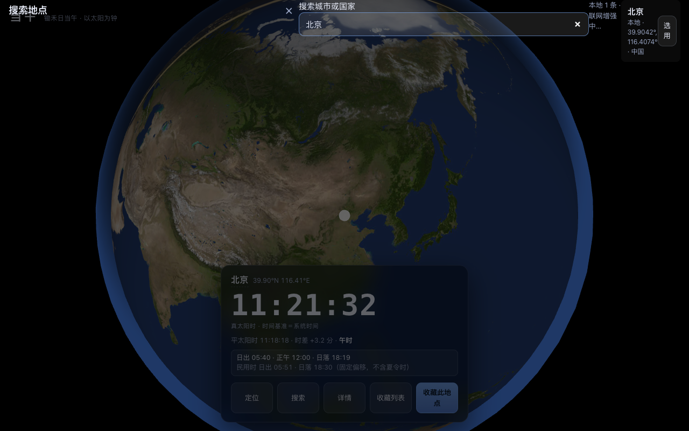
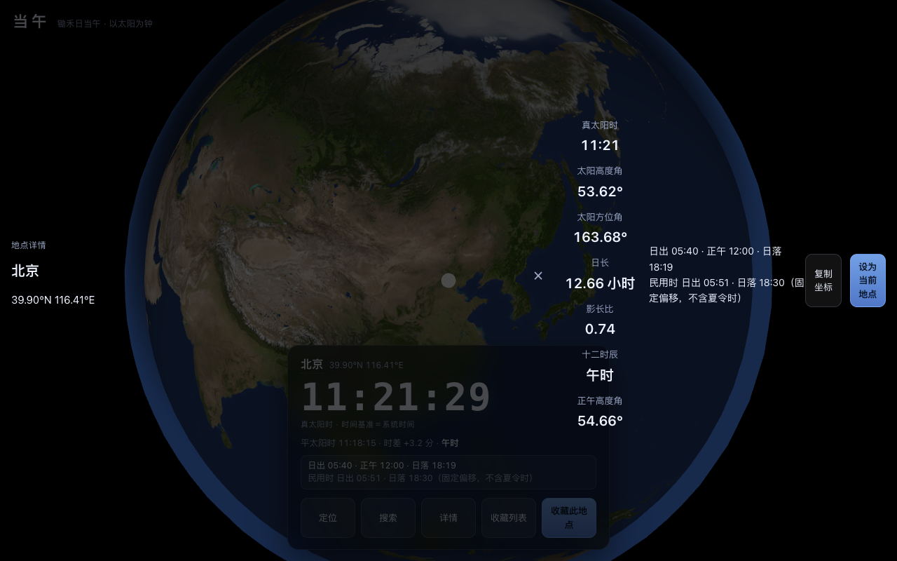
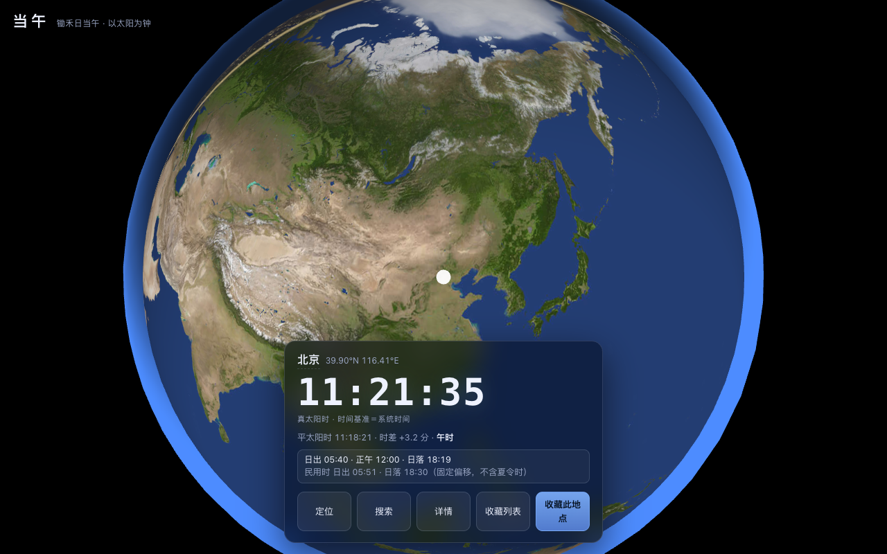

# 当午 · 真太阳时 + 实时昼夜地球

输入任意经纬度即得真太阳时；首页是一颗实时昼夜交替的地球。名字取自「锄禾日当午」。

核心用户：八字/命理排盘（真太阳时是刚需）、天文摄影、户外航海、日晷爱好者。

> **架构红利**：真太阳时 = UTC + 经度修正 + 时差（EoT），与时区、夏令时完全无关。
> 核心功能**零网络、零时区库、可完整离线运行**；联网搜索与定位均为可选增强。

🔗 在线预览：<https://orderye.github.io/dangwu-web/>

| | |
|---|---|
|  |  |
|  |  |

## 功能

- **真太阳时主口径**：以太阳本身为钟，展示真太阳时（TST）、平太阳时、时差 EoT、太阳高度角与方位角、日出/日落/民用晨昏、十二时辰（八字用）。
- **实时昼夜地球**：Three.js 球体 + 自定义昼夜 shader，太阳方向随真实时间每秒更新，昼夜界线平滑过渡；8K NASA 贴图支撑近距离观察。
- **放大倍数档位**：`2× / 3× / 4× / 6× / 8× / 12×` 六档精确倍数，点击即以 220ms 缓动过渡；切档只改变相机到球心的距离，**保留用户手动拖拽出的朝向**。
- **点球选点**：点击地球任意位置设为当前地点，支持收藏、对比（最多 4 地）、切换。
- **离线城市搜索**：内置 GeoNames 城市索引，中英文别名匹配，无需联网。
- **城市标签 LOD**：城市点按人口分层绘制，近景显示更密集、标签按屏幕空间去重叠放置。
- **PWA 离线**：Service Worker 缓存核心资源，飞行模式下完整可用（离线后仍可查已缓存内容）。

## 快速开始

无任何构建步骤，纯原生 ES Module。three.js 已本地化在 `vendor/`，克隆即可运行。

```bash
# 本地静态服务（PWA 与 ES Module 均需 http，不支持 file:// 双击打开）
python3 -m http.server 5173 --bind 127.0.0.1
# → http://127.0.0.1:5173
```

或直接用 `npm` 脚本：

```bash
npm run serve     # 本地服务
npm test          # 单元测试（零依赖，node 直接跑）
npm run smoke     # PWA 冒烟门禁（需 Playwright + Chromium/Edge）
npm run verify    # 与 golden 数据交叉验证
npm run check     # verify + test
```

## 测试

```
npm test     →  引擎 1239 项 + UI 7 项 + 搜索合规 8 项，全部 0 失败
npm run smoke →  冒烟门禁 34 项（渲染、点球选、离线、Service Worker）
tools/zoom-test.mjs →  放大档位 22 项（相机距离精确性、高亮迁移、拖拽后不漂移）
```

引擎测试以 golden 数据为基准，容差：EoT ±0.5 分 | 赤纬 ±0.2° | 事件 ±3 分 | 高度角 ±0.02° | 方位角 ±0.2°。

## 目录结构

```
dangwu-web/
  index.html                页面骨架（时间卡 / 搜索 / 收藏 / 详情 / 放大档位控件）
  sw.js                     Service Worker（离线缓存，当前版本 v5）
  src/
    core/solar.js           太阳算法引擎（NOAA 简化模型）
    globe/Globe.js          Three.js 球体、昼夜 shader、城市点 LOD、拾取、放大档位
    ui/                     时间卡、搜索、收藏、详情、关于、展示层格式化
    store/storage.js        localStorage 持久化（收藏、当前地点、对比栏）
    data/cities.json        GeoNames 离线索引（4861 城市，含 IANA 时区）
    data/cities.meta.json   快照日期、来源 URL、sha256、许可
    styles.css              样式（毛玻璃卡片、深色主题、档位控件）
  vendor/three/             three.js 本地副本（无 CDN 依赖）
  assets/                   地球昼夜贴图（4K / 8K）+ NOTICE 署名
  tests/                    零依赖测试
  tools/                    数据构建、golden 生成、交叉验证、冒烟门禁
```

## 核心算法

`src/core/solar.js` 实现 NOAA 简化太阳位置模型，全部为纯函数、无副作用：

- `solarCalc(date)` — 时差 EoT、太阳赤纬、平太阳时
- `trueSolarMin(d, lon, eot)` — 真太阳时（分钟）
- `sunEvents(d, lat, lon)` — 日出、日落、民用晨昏
- `solarAltAz(d, lat, lon)` — 太阳高度角 / 方位角
- `shichen(tst)` — 十二时辰（八字排盘用）

真太阳时的计算只依赖经度与时差，**完全不涉及时区或夏令时**，因此不存在「时区换算错误」这一类 bug。

## 数据与许可

| 数据 | 来源 | 许可 |
|---|---|---|
| 地球白昼/夜灯贴图 4K | NASA Blue Marble / Black Marble，经 three.js 官方仓库转存 | 公有领域 |
| 地球贴图 8K | Solar System Scope 纹理库 | CC BY 4.0 |
| 离线城市索引 | GeoNames `cities15000` + `alternateNamesV2` | CC BY 4.0 |
| 在线搜索 | Nominatim（底层 © OpenStreetMap contributors） | ODbL |

贴图与数据的快照日期、校验和、来源 URL 见 `assets/NOTICE.md` 与 `src/data/cities.meta.json`。
项目本身采用 MIT 许可。

## 相关项目

Android 端（Kotlin + Jetpack Compose）为独立仓库，使用独立的 OpenGL ES 2.0 地球实现，
目前尚未包含城市点、纹理与放大档位功能。
